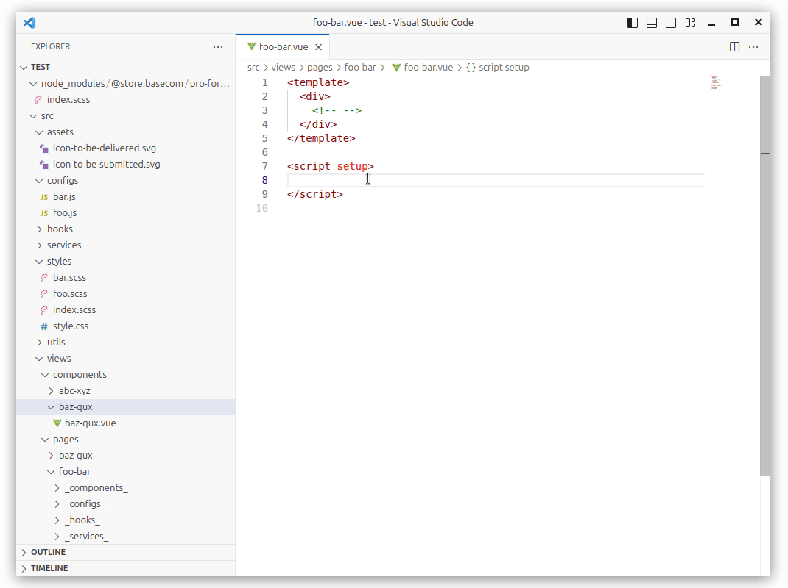
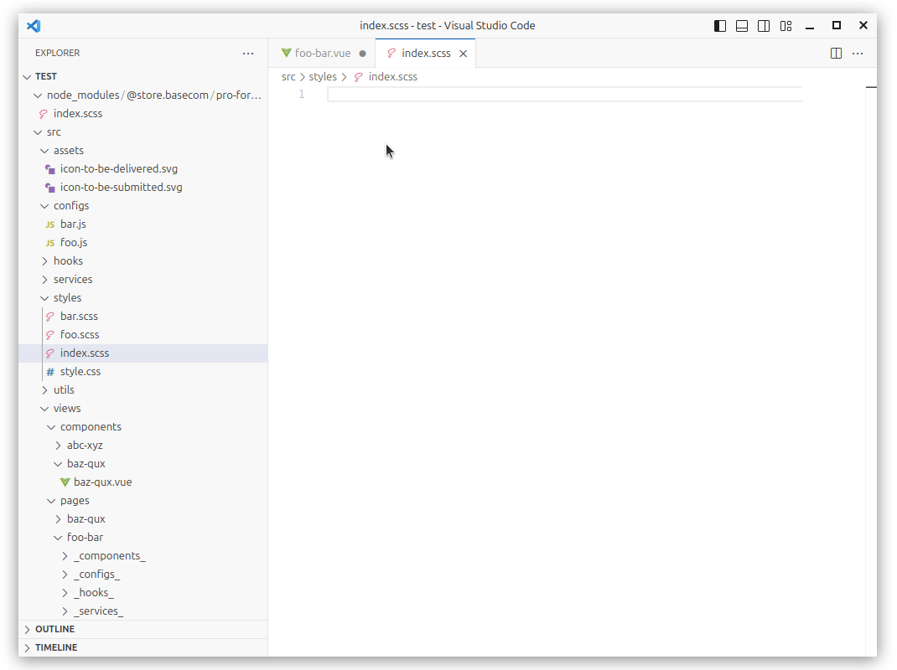
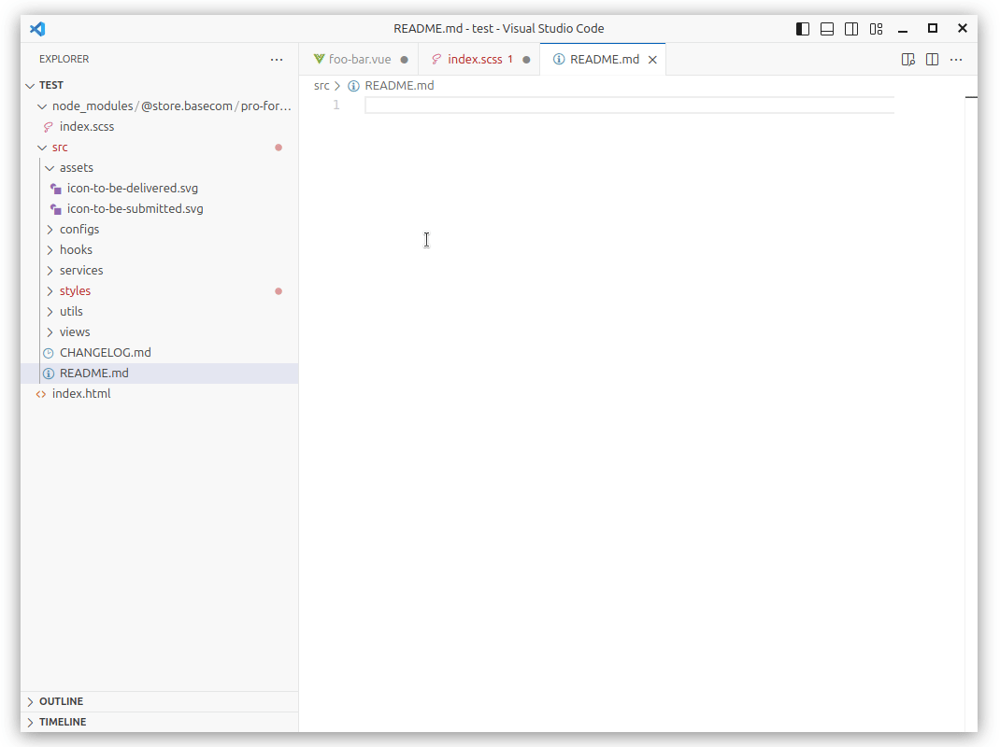

  <h1 align="center">Drag --(shift)--> Drop --> Import</h1>

  
  
  
  
  

Fork: 🎉 Here ← [ElecTreeFrying/drag-import-relative-path](https://github.com/ElecTreeFrying/drag-import-relative-path) 🫰.

## Usage / 使用方法

1. **Drag** supported files from the tree view.
2. Hold `shift`
3. **Drop** them into any of your active editors.

--

1. 在侧边资源管理器中，鼠标左键拖着文件不松开
2. 按住 `shift`
3. 拖到编辑器中导入位置，松开鼠标，完成导入

## Example / 示例

## Supported file extensions / 支持的文件类型

| Drop         | Drag                                                                                                                       |
|--------------|----------------------------------------------------------------------------------------------------------------------------|
| `.vue`       | `.vue` `.js` `.json` `.css`, `.sass`, `.scss`, `.less` `.gif`, `.jpeg`, `.jpg`, `.png`, `.svg`, `.webp`        |
| `.js`, `.ts` | `.js`, `.ts` `.json` `.css`, `.sass`, `.scss`, `.less` `.gif`, `.jpeg`, `.jpg`, `.png`, `.svg`, `.webp`           |
| `.jsx`       | `.jsx` `.js` `.json` `.css`, `.sass`, `.scss`, `.less` `.gif`, `.jpeg`, `.jpg`, `.png`, `.svg`, `.webp`        |
| `.tsx`       | `.tsx` `.ts`, `.js` `.json` `.css`, `.sass`, `.scss`, `.less` `.gif`, `.jpeg`, `.jpg`, `.png`, `.svg`, `.webp` |
| `.css`       | `.css` `.gif`, `.jpeg`, `.jpg`, `.png`, `.svg`, `.webp`                                                                 |
| `.scss`      | `.scss`  `.css` `.gif`, `.jpeg`, `.jpg`, `.png`, `.svg`, `.webp`                                                     |
| `.html`      | `.js` `.css` `.gif`, `.jpeg`, `.jpg`, `.png`, `.svg`, `.webp`                                                        |
| `.md`        | `.md` `.gif`, `.jpeg`, `.jpg`, `.png`, `.svg`, `.webp`                                                                  |

## Settings / 设置

- `dragDropImport.importStatements.pathMappings`, Path mappings configuration/路径映射配置，默认配置适配了 [Vue CLI / URL 转换规则](https://cli.vuejs.org/zh/guide/html-and-static-assets.html#url-%E8%BD%AC%E6%8D%A2%E8%A7%84%E5%88%99)
- `dragDropImport.importStatements.pathStyle`, Path style configuration/路径风格配置 (支持别名路径、相对路径)

## License 📃

MIT License

## Donate 🎉

Powered By [Cursor](https://www.cursor.com/) 💝
